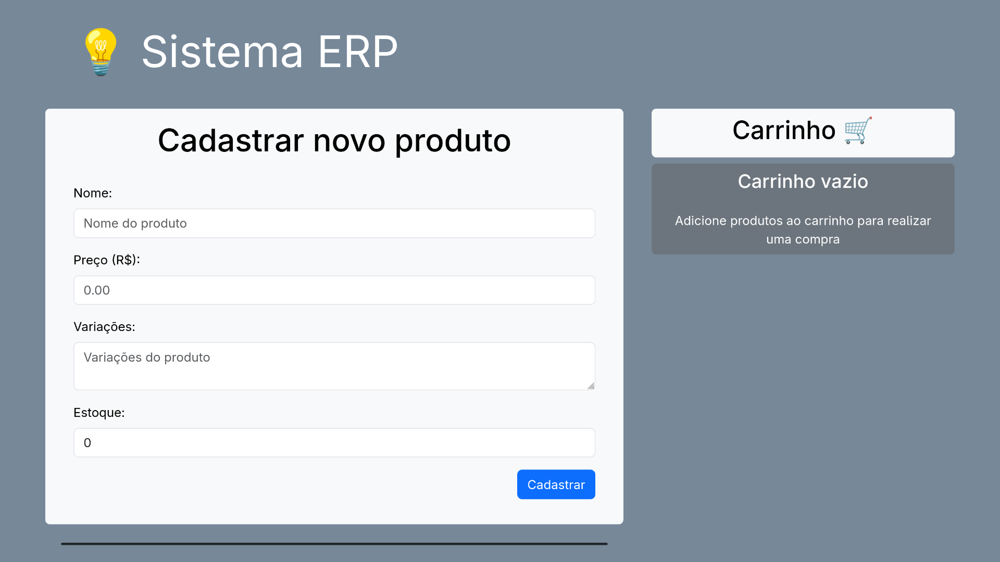
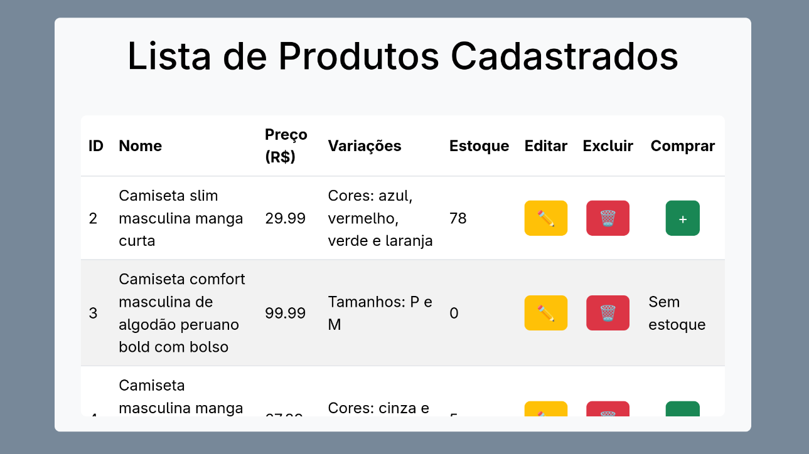
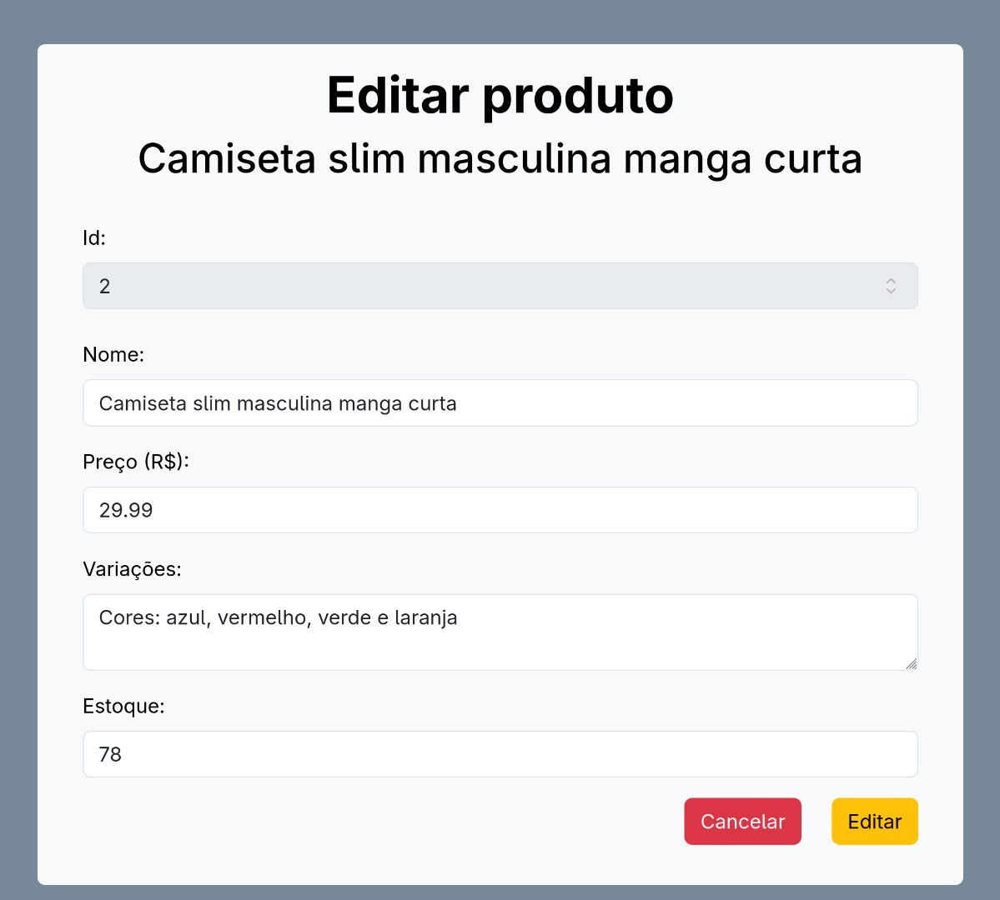
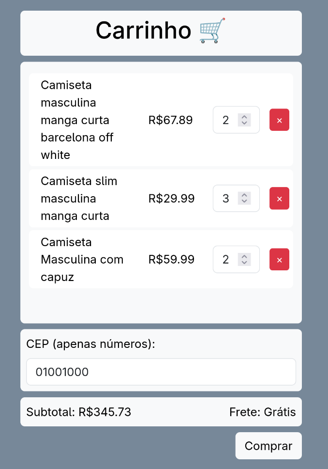

# Case Montink
Mini ERP para controle de Pedidos, Produtos e Estoque



## Sobre
O projeto foi desenvolvido durante o processo seletivo para a vaga de "Desenvolvedor Back End - PHP"

## Funcionalidades
O sistema permite o *cadastro*, *visualização*, *edição* e *remoção* de produtos e seus respectivos *estoques*, além de um **carrinho de compras** gerenciado por sessão

- **Cadastro**
  - Ao clicar em "Cadastrar", com as informações do produto preenchidas no formulário, o sistema realiza a operação e retorna uma mensagem com o resultado, destacando itens incorretos caso haja algum
  
- **Visualização**
  - Uma lista com os produtos cadastrados é exibida abaixo do formulário de cadastro

- **Edição**
  - Ao clicar no botão de editar, na lista de produtos, o conteúdo do formulário é preenchido com as informações e permite a alteração ou cancelamento da operação

- **Remoção**
  - Ao clicar no botão de remover, o produto é removido do sistema

- **Pedido**
  - É possível adicionar produtos ao pedido por meio da lista e editar as quantidades no carrinho
  - Para finalizar o pedido é necessário preencher o CEP, que é verificado antes de confirmar a compra

## Screenshots
### Lista de produtos


### Edição de produtos


### Carrinho


### Pedido realizado


## Como executar o projeto
### Dependências
- MySQL
- PHP
  - É possível utilizar o PHP por um container via [toolbx](https://docs.fedoraproject.org/pt_BR/fedora-silverblue/toolbox/). Clique [aqui](https://www.php.net/manual/pt_BR/install.unix.dnf.php) para mais informações sobre a instalação

### Passo a passo
1. Clone o projeto
```bash
$ git clone https://github.com/GuilhermeQuirinoCruz/case-montink
```

2. (Opcional) Crie um [container](https://hub.docker.com/_/mysql) para o banco de dados
```bash
$ podman run --name db-montink -p 3306:3306 -e MYSQL_ROOT_PASSWORD=password -d docker.io/mysql:latest
```

3. Configure as variáveis de acesso ao banco de dados no arquivo [db.php](./src/controller/db.php)
```php
// Exemplo
$dbHost = "127.0.0.1";
$dbName = "erp";
$dbUser = "root";
$dbPassword = "password";
```

4. Execute os comandos do arquivo [database.sql](./database.sql) para criar o banco de dados e as tabelas

5. Na pasta raiz do projeto, inicie o servidor e acesse o sistema pelo navegador

```bash
# Exemplo utilizando o servidor embutido do php
$ php -S localhost:8080

# Para abrir o servidor para outros dispositivos na mesma rede
$ php -S 0.0.0.0:8080
```

> [!IMPORTANT]  
> Utilize o servidor embutido apenas para testes em ambiente controlado